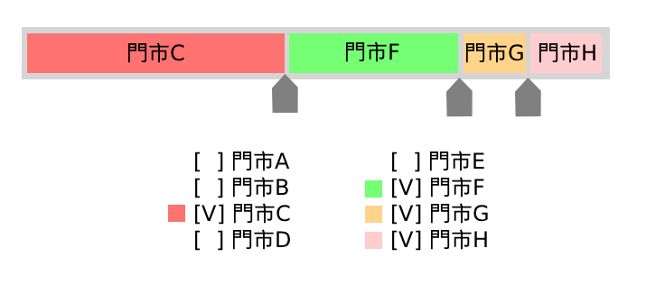
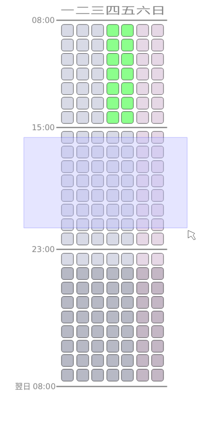

# 自動化排班表系統 — 完整計劃書

> 本文件以 README.md 為基礎擴充，包含系統設計、技術架構、資料模型、功能規格與開發路線圖。

---

## 1. 系統概覽

### 1.1 目標

本系統服務對象為擁有多間加盟門市的加盟主，核心目標如下：

- 讓員工自行填寫每週可排班時段與跨門市上班意願（偏好比重）
- 由系統依據人力需求與員工意願自動產生班表雛型
- 管理者可在雛型基礎上進行手動微調
- 支援多層組織架構（組織 → 門市），各層級享有獨立的存取控制

### 1.2 核心術語

| 術語 | 說明 |
|------|------|
| 組織（Organization） | 最高層級，通常對應一位加盟主所有的事業體 |
| 門市（Store） | 組織下的單一實體店面 |
| 身份組（Role Group） | 賦予一組權限的標籤，可為組織層級或門市層級；使用者可跨門市擁有多個 |
| 班表（Schedule） | 以一週為周期、精確到小時的人力配置表 |
| 排班偏好（Preference） | 員工對各門市的上班意願比重（總和為 1.0） |
| 可用時段（Availability） | 員工可被排入班表的時間區間；以週為單位，支援提前填寫多週 |
| 排班截止日（Schedule Deadline） | 每週自動排班必須完成的期限，預設為目標週前一週的週六 |
| 工時統計（Work Hours Summary） | 員工於指定期間內實際被安排的工時，作為薪資計算依據 |

---

## 2. 組織架構

### 2.1 層級結構

```
系統（System）
└── 組織 A（Organization）
    ├── 門市 A（Store）
    ├── 門市 B（Store）
    └── 門市 C（Store）
└── 組織 B
    └── ...
```

- 一個組織可擁有任意數量的門市
- 組織管理員的操作範圍限定在自身組織內，無法跨組織存取

### 2.2 身份組（Role Group）

每位使用者可同時擁有多個身份組，身份組為系統管理員自由定義，預設如下：

| 身份組 | 層級 | 典型角色 |
|--------|------|---------|
| 系統管理者（System Admin） | 系統 | 平台維運人員 |
| 組織管理者（Org Admin） | 組織 | 加盟主、區域主管 |
| 店經理（Store Manager） | 門市 | 各門市經理 |
| 全職員工（FT） | 門市 | Full-Time 員工 |
| 兼職員工（PT） | 門市 | Part-Time 員工 |
| 自訂身份組 | 組織 / 門市 | 依需求自由新增 |

**重要設計決策**：
- 員工**不與特定單一門市綁定**，而是透過身份組與門市關聯
- 一位員工可同時持有多間門市的身份組（例如同時是門市 A 的 FT 及門市 B 的 PT）
- 身份組的適用範圍可**多選門市**（`store_ids: UUID[]`）：留空 = 全組織生效，選取一至多間門市 = 僅於這些門市生效；範圍可於建立後隨時修改

### 2.3 權限系統

權限賦予身份組，身份組再指派給使用者。細分如下：

#### 系統層級
- `system.all` — 所有權限（系統管理者專用）

#### 組織層級
- `org.manage` — 管理組織設定、身份組、使用者
- `org.schedule.view_all` — 檢視組織下所有門市班表
- `org.schedule.arrange` — 執行自動排班 / 手動安排班表
- `org.employee.manage` — 新增、停用、調動員工

#### 門市層級
- `store.schedule.view` — 檢視所在門市班表
- `store.schedule.edit` — 手動修改門市班表
- `store.demand.edit` — 修改門市各時段人力需求數
- `store.schedule.deadline.manage` — 設定及調整本門市的排班截止日（員工填寫截止）

#### 個人層級
- `self.schedule.view` — 檢視個人班表
- `self.availability.edit` — 修改個人可排班時段
- `self.preference.edit` — 修改個人各門市上班意願比重
- `self.profile.edit` — 修改個人基本資料

#### 跨員工管理
- `employee.availability.edit` — 修改任意員工可排班時段
- `employee.preference.edit` — 修改任意員工各門市意願
- `employee.payroll.view` — 檢視員工工時統計與薪資報表
- `employee.contract.edit` — 設定員工時薪 / 合約類型
- 🆕 `employee.identity.view` — 檢視員工真實姓名（`name`）；無此權限者一律僅見 `nickname`（見第 11 節議題 8、3.1）

---

## 3. 資料模型

### 3.1 使用者（User）

```
User
├── id: UUID
├── name: string
├── email: string
├── phone: string
├── organization_id: UUID（FK）
├── role_groups: RoleGroup[]（多對多）
├── is_active: boolean
└── created_at: timestamp
```

> 🆕 **提案中欄位（來源：IDEA-01，個人資料擴充）**：
> ```
> ├── nickname: string         （暱稱，對所有人公開；姓名 name 僅對有權限者公開）
> ├── avatar_url: string | null（頭像）
> ├── note: string | null      （備註，僅管理者可見）
> ├── hire_date: date | null   （入職日期）
> └── skills: Skill[]          （職位等級／工作能力，多對多，見 3.4.3）
> ```
> ✅ **已決策（2026-06-08，回應第 11 節議題 8）**：`name` 的可見度規則由「全員可見」改為「依權限分級」——持有新增權限 `employee.identity.view`（透過身份組賦予）者可見真實姓名 `name`；不具此權限者一律僅見 `nickname`。`nickname` 對組織內所有人公開。
> **影響範圍（待排入 Phase 2 實作，與「個人資料擴充」一併進行）**：
> 1. **後端**：所有回傳 `User`/員工資訊的端點需依請求者是否具備 `employee.identity.view` 決定回傳 `name` 或以 `nickname` 取代；建議在序列化層統一處理（例如回應 schema 新增 `display_name` 欄位，由後端依權限動態決定其值，前端一律顯示 `display_name`）
> 2. **前端**：`/employees` 員工清單／管理頁、班表 Grid、手動排班側邊欄、AI 輔助審查（見 5.3.4）等所有顯示員工姓名之處，全面改為顯示後端回傳的 `display_name`
> 3. **預設身份組**：建議「店長／管理者」等既有管理職身份組預設附加 `employee.identity.view`（可於 seed/migration 時一併授予），避免既有管理者升級後看不到員工真實姓名

### 3.2 組織（Organization）

```
Organization
├── id: UUID
├── name: string
├── owner_user_id: UUID
└── created_at: timestamp
```

### 3.3 門市（Store）

```
Store
├── id: UUID
├── organization_id: UUID（FK）
├── name: string
├── address: string
├── timezone: string（例：Asia/Taipei）
└── created_at: timestamp
```

> 🆕 **提案中欄位（來源：IDEA-01，門市管理頁面）**：
> ```
> ├── manager_user_id: UUID | null（門市負責人，FK → User）
> └── color: string                （門市代表色，hex；用於個人班表跨店配色、門市清單視覺辨識）
> ```

### 3.4 身份組（RoleGroup）

```
RoleGroup
├── id: UUID
├── organization_id: UUID（FK，null 表示系統層級）
├── store_ids: UUID[]（空陣列表示組織層級；非空表示僅作用於所列門市）
├── name: string
└── permissions: Permission[]（多對多）
```

> **作用域規則**：`store_ids = []` 的身份組對整個組織生效；`store_ids` 非空的身份組僅對所列門市生效，可同時涵蓋多間門市。
> 使用者可同時持有不同門市的多個門市層級身份組。範圍欄位可於建立後在編輯畫面隨時修改（複選清單 UI）。

### 3.4.1 使用者身份組指派（UserRoleGroup）

```
UserRoleGroup
├── user_id: UUID（FK）
├── role_group_id: UUID（FK）
└── granted_at: timestamp
```

### 3.4.2 員工合約（EmployeeContract）

記錄薪資計算所需的合約資訊，供工時統計使用。

```
EmployeeContract（v2 — 已決策重新設計，2026-06-08，取代下方舊版欄位）
├── id: UUID
├── user_id: UUID（FK）
├── store_id: UUID（FK，合約所屬門市）
├── contract_type: enum（FT / PT / custom / null）
├── monthly_salary: decimal | null（月薪；僅 FT 填寫）
├── hourly_rate: decimal | null（時薪；僅 PT 填寫，幣別由組織設定）
├── effective_from: date
├── effective_until: date | null（null 表示持續有效）
└── created_at: timestamp
```

> ✅ **已決策（2026-06-08，源自 IDEA-01，回應第 11 節議題 7）**：採用依合約別分流欄位的新設計，**取代**原本對所有合約別套用同一組欄位（`hourly_rate` + `weekly_hour_min/max` + 起訖時間）的舊版模型：
> - **FT**：只填 `monthly_salary`（月薪），不計算時薪；不需起訖時間、不需最大/最小排班時間
> - **PT**：只填 `hourly_rate`（時薪），不計算月薪；不需起訖時間、不需最大/最小排班時間
> - **CUSTOM**：不填任何薪資欄位，屬特殊人員（例如約聘外包、無薪職務）
> - **NULL**：尚未指派合約別
>
> **(b) 自動排班不再設定每週工時上限**：原 4.2 節「每週上限」約束（單週最多工時上限，FT/PT 分別設定）**移除**，`weekly_hour_max` / `weekly_hour_min` 欄位一併移除（見下方 4.2 異動說明）。
>
> **遷移與影響範圍（待排入 Phase 2 實作）**：
> 1. **資料庫**：Alembic migration 新增 `monthly_salary` 欄位、移除 `weekly_hour_min`/`weekly_hour_max`；`hourly_rate` 改為 nullable；既有資料依 `contract_type` 分流搬遷（FT 合約若先前以 `hourly_rate` 記錄，需提供管理者手動換算為月薪的遷移流程，系統不自動推算）
> 2. **後端**：`backend/app/schemas/contract.py`、`backend/app/api/v1/contracts.py` 改為依 `contract_type` 條件式驗證必填欄位
> 3. **前端**：重新設計 `/employees` 合約編輯器 UI（依合約別切換顯示 `monthly_salary` 或 `hourly_rate` 欄位，移除起訖時間與工時上下限輸入）
> 4. **薪資計算**：`PayrollReport` 計算邏輯需分流 — FT 直接採用合約 `monthly_salary`（不依工時計算 `gross_pay`，`total_hours` 僅作紀錄用途）；PT 維持 `total_hours × hourly_rate_snapshot`；CUSTOM 不產生 `gross_pay`
> 5. **排班演算法**：移除「每週工時上限」約束的程式邏輯與相關設定 UI（若先前已實作）

### 3.4.3 職位等級／工作能力（Skill）✅ 已實作（2026-06-08）

來源：IDEA-01「職位等級（能力）」。部分時段需要具備特定能力的員工才能正常運作（例：開店、關店、日結帳、補貨），此處新增能力標籤實體與指派關係。

```
Skill
├── id: UUID
├── organization_id: UUID（FK，組織自訂能力標籤）
├── name: string（例：日結帳 / 補貨 / 關店 / 開店 / 自訂...）
└── created_at: timestamp

UserSkill
├── user_id: UUID（FK）
├── skill_id: UUID（FK）
└── granted_at: timestamp
```

> 預設提供「日結帳、補貨、關店、開店」四項能力，組織可自訂新增。對應 User 的 `skills: Skill[]`（見 3.1）。

### 3.5 員工門市偏好（StorePreference）

```
StorePreference
├── id: UUID
├── user_id: UUID（FK）
├── store_id: UUID（FK）
└── weight: float（0.0 ~ 1.0，同一使用者所有門市總和應等於 1.0）
```

### 3.6 可用時段（Availability）

排班周期以週為單位，但員工可提前填寫多週的可用時段。每筆記錄對應一個自然週。

```
Availability
├── id: UUID
├── user_id: UUID（FK）
├── week_start: date（該週起始日，固定為週一）
├── slots: boolean[7][24]（7 天 × 24 小時的可用格；索引 0 = 週一 00:00）
├── is_default_template: boolean（標記為「預設模板」，新週自動複製此筆作為初始值）
├── locked: boolean（管理者鎖定後員工無法再修改）
└── updated_at: timestamp
```

**跨週填寫規則**：
- 員工可一次填寫未來 N 週（N 由組織設定，預設 4 週）的可用時段
- 若某週未手動填寫，系統自動從 `is_default_template = true` 的記錄複製作為初始值
- 跨夜班（例如週日 23:00 → 週一 01:00）透過填寫各自週的對應小時格表達，演算法負責銜接

### 3.7 人力需求（DemandTemplate）

```
DemandTemplate
├── id: UUID
├── store_id: UUID（FK）
├── week_start: date
├── slots: int[7][24]（各時段需求人數）
└── updated_at: timestamp
```

### 3.7.1 門市能力需求（StoreSkillDemand）✅ 已實作（IDEA-02，2026-06-08）

來源：IDEA-01「門市管理頁面 — 工作能力需求表」，並依 IDEA-02 修訂為「標籤制 + 單表整合」。標示哪些時段「需要具備特定能力的人在場」（見 3.4.3 `Skill`），供自動排班演算法作為額外限制條件（best-effort 覆蓋需求：優先讓具備該能力者進入該時段，人力不足時不強制整體失敗）。

```
StoreSkillDemand
├── id: UUID
├── store_id: UUID（FK）
├── week_start: date
├── skill_id: UUID（FK → Skill）
├── slots: boolean[7][24]（各時段是否「需要具備此能力者在場」；true = 需要，索引 0 = 週一 00:00）
└── updated_at: timestamp
```

> ✅ **IDEA-02 修訂並完成實作與瀏覽器端到端驗證（2026-06-08）— 取代原「方案 A：疊加層 + 子需求人數」設計（方案 A 曾上線，見議題 9 → 議題 10）**：
> 1. **能力改為純標籤（不設人數）**：`slots` 由 `int[7][24]`（需求人數）改為 `boolean[7][24]`（是否需要此能力）。語意由「此時段需要 N 位具備此能力者」簡化為「此時段需要有人具備此能力」（即子配額固定為 1，至少一人）。
> 2. **與人數需求同表、同操作**：能力需求與人數需求在 `/settings/demand` **同一張表**內完成，採完全相同的互動 —— **先拖曳選取範圍 → 再點選筆刷**。筆刷盤同時包含人數（0–5）與各能力標籤（如 補貨／開店／關店／日結帳）。
>    - 點選**人數**：將選取格設為該人數（沿用既有行為）
>    - 點選**能力標籤**：對選取格切換（toggle）該能力需求（全部已標記 → 取消標記；否則 → 標記）
> 3. **單表呈現**：每個格子同時顯示「需求人數」與其上掛的能力標籤色點；不再有獨立的疊加層開關，也不再有各能力獨立的子網格編輯器。
> 4. **儲存**：人數需求（`DemandTemplate`）與能力需求（`StoreSkillDemand`，每個能力一列）由同一個「儲存變更」動作一併送出（人數 → `PUT /demand`；每個有異動的能力 → `PUT /skill-demand`）。
>
> **設計理由保留（沿用議題 9）**：仍採獨立 `StoreSkillDemand` 表（不合併進 `DemandTemplate.slots`），避免主需求矩陣維度爆炸，並讓排班演算法將「總人數」與「能力覆蓋」拆開驗證。
>
> **與排班演算法的關係**：見 4.2 —— 對被標記能力 X 的時段，視為「至少一位被指派者需具備能力 X」的覆蓋約束（best-effort）。零人數需求的格子即使被標記能力也不會產生指派（無作用）。
>
> 前端 API client：`src/lib/skills-api.ts`；員工端能力指派 UI 位於 `/employees`（「工作能力」卡片，晶片式 toggle + 樂觀 toast 回饋）。
>
> **實作完成記錄（2026-06-08）**：Alembic migration `d7e5f3a9b1c4`（`int[7][24]` → `boolean[7][24]`，含資料轉換 `v > 0` 與回滾）；`schemas/skill.py`／`models/skill.py` 改型別為 `list[list[bool]]`；`scheduler.py` 子配額邏輯由「N 人」改為「至少 1 人覆蓋」；`/settings/demand` 重構為單一 `BrushPalette`（人數按鈕 0–5 + 能力標籤晶片同列），格內常駐顯示能力色點，移除疊加層開關／子網格編輯器／`OverlaySkill`／`SkillControls` 等舊元件，單一「儲存變更」按鈕統一送出人數與能力標籤異動。已於瀏覽器完成端到端驗證（拖曳選取 → 點選筆刷套用/取消、重新整理後資料正確回填、DB 確認 `slots` 為 `boolean[7][24]`）。

### 3.8 班表生命周期配置（ScheduleDeadlineConfig）

每個門市可獨立設定排班截止日規則。

```
ScheduleDeadlineConfig
├── id: UUID
├── store_id: UUID（FK）
├── days_before_week_start: int（目標週開始前幾天必須完成排班，預設 2，即週六）
├── deadline_time: time（當天幾點截止，預設 23:59）
└── updated_at: timestamp
```

> 範例：目標週為 2026-06-08（週一），`days_before_week_start = 2` → 截止日為 2026-06-06（週六）23:59。

### 3.9 班表（Schedule）

```
Schedule
├── id: UUID
├── store_id: UUID（FK）
├── week_start: date
├── status: enum（draft / published / archived）
│   ├── draft      → 自動排班後的草稿，管理者可自由修改
│   ├── published  → 對員工公開，員工可查看自己的班表；管理者仍可修改
│   └── archived   → 該週結束後歸檔，唯讀
├── generated_at: timestamp
├── published_at: timestamp | null
└── assignments: Assignment[]
```

**狀態流轉**：
```
[自動排班觸發] → draft → (管理者手動微調) → published → archived
```

> 班表在任何 status 下，擁有 `store.schedule.edit` 的管理者均可修改；「鎖定」概念僅適用於員工的**可用時段填寫**（截止日後 Availability `locked = true`），班表本身不設編輯鎖。

### 3.10 班表指派（Assignment）

```
Assignment
├── id: UUID
├── schedule_id: UUID（FK）
├── user_id: UUID（FK）
├── store_id: UUID（FK）
├── day: int（0=週一 … 6=週日）
├── hour: int（0~23）
├── is_manual: boolean（手動覆蓋則為 true）
└── created_at: timestamp
```

### 3.11 工時統計與薪資報表（PayrollReport）

由系統於班表歸檔（archived）時自動計算，或由管理者手動觸發。

```
PayrollReport
├── id: UUID
├── user_id: UUID（FK）
├── store_id: UUID（FK）
├── week_start: date
├── total_hours: decimal（當週實際排班總時數）
├── hourly_rate_snapshot: decimal（計算當時的時薪快照）
├── gross_pay: decimal（total_hours × hourly_rate_snapshot）
├── currency: string（例：TWD）
├── generated_at: timestamp
└── note: string | null（備註，例如加班說明）
```

> **注意**：`hourly_rate_snapshot` 為計算時的時薪快照，確保歷史報表不受後續合約異動影響。

---

## 4. 自動排班演算法

### 4.1 輸入

- 各門市當週每小時人力需求數
- 各員工可用時段（7×24 布林陣列）
- 各員工對各門市的偏好比重

### 4.2 目標函數

最大化以下加權分數之總和：

```
score(assignment) = preference_weight(employee, store) × availability(employee, slot)
```

同時滿足以下約束：

1. **需求滿足**：每個時段分配人數 ≥ 需求數（或儘可能接近）
2. **可用性**：只能指派員工可用的時段
3. **連續性**：避免孤立的單小時班次（最短連續工作時間可設定）
4. **每日上限**：單日最多工時上限（預設 8 小時）
5. **跨店限制**：同一天不可被安排到需跨越通勤距離的門市
6. **能力覆蓋（best-effort，IDEA-02）**：若某時段被標記需要能力 X（見 3.7.1 `StoreSkillDemand`，標籤制），則於該時段優先指派至少一位具備能力 X 的員工；人力不足時不強制失敗（子配額固定為 1，多個能力標籤則各自至少一人）

> ✅ **已決策（2026-06-08）**：移除原本的「每週上限」約束（單週最多工時上限，FT / PT 分別設定）。自動排班不再依合約設定每週工時上限；對應的 `EmployeeContract.weekly_hour_min` / `weekly_hour_max` 欄位亦一併移除（見 3.4.2 v2 設計）。

### 4.3 演算法選擇

推薦採用**混合整數線性規劃（MILP）**搭配 greedy heuristic 初始化：

- 小規模（< 50 員工，< 5 門市）：直接跑 MILP（PuLP / OR-Tools）
- 大規模：先用 greedy 產生可行解，再用 local search 改善

### 4.4 流程

```
1. [系統排程] 在截止日（週六）前自動觸發，或管理者手動觸發
2. 載入目標週需求 & 員工偏好 & 各員工該週可用時段
   └─ 若員工未填當週時段，自動使用其 is_default_template 的可用格
3. 按門市 × 時段分組，排列候選員工（依偏好比重降冪）
4. 執行 MILP / greedy 求解
5. 產生草稿班表（status = draft）
6. 通知具 store.schedule.edit 權限的管理者審核
7. 管理者手動微調後對員工發佈（status = published）；可繼續修改
8. 目標週結束後自動歸檔（status = archived），觸發 PayrollReport 計算
```

**多週排班**：管理者可一次觸發多週的排班計算；每週仍產生獨立的 Schedule 記錄，但介面可並排顯示跨週班表。

---

## 5. 功能規格

### 5.1 管理界面

#### 5.1.1 班表總覽（Grid View）

- 橫軸：7 天（或選擇日期範圍）
- 縱軸：24 小時
- 每格顯示：已指派員工數 / 需求人數
- 顏色熱力圖：
  - 綠色：供給充足（≥ 需求）
  - 黃色：供給不足（< 需求）
  - 紅色：嚴重不足（< 需求 50%）
  - 灰色：無需求時段

#### 5.1.2 手動排班

> ✅ **已實作並通過瀏覽器端到端驗證（2026-06-08）**：`/schedules` 新增「手動編輯」分頁，使用 dnd-kit 實作拖曳排班，詳見下方實作記錄。

- 員工清單（側邊欄）顯示：姓名、本週已排時數（拖曳卡片，依大頭貼顏色與員工視角一致）
- 支援拖曳員工卡片至 7×24 時格新增指派；拖曳已排班大頭貼可在時格間移動，或拖曳到垃圾桶區移除
- 拖曳放置後自動驗證可用性（呼叫 `GET /users/{user_id}/availability?week=`，無權限時靜默略過驗證），違規時以警告 toast 提示「已強制排班」，**仍會完成放置**
- 重複指派防呆：同一員工已在該時段時顯示錯誤 toast 並中止操作
- 手動指派一律以 `is_manual = true` 標記（後端 `POST /assignments` 自動處理），重新自動排班不會覆蓋
- 支援 undo（最多保留 10 步）：每個操作（新增／移動／移除）會推入「逆操作」closure，點擊「復原」依序執行對應的建立／刪除 API 呼叫並還原畫面

**實作完成記錄（2026-06-08）**：
- 前端：`schedules/page.tsx` 新增 `ManualEditView`（含 `DraggableEmployeeCard`、`DraggableChip`、`DroppableCell`、`DroppableTrash`），以 `DndContext` + `useDraggable`/`useDroppable`/`DragOverlay` 實作；`schedules-api.ts` 新增 `createAssignment`/`deleteAssignment`；`availability-api.ts` 新增 `fetchUserAvailability`
- 修正 `apiFetch` 對 204/空回應的 JSON 解析錯誤（DELETE 回應為空 body 時不再丟出 "Unexpected end of JSON input"）
- 順帶修正後端 `scheduler.py` 既有 bug：`load_inputs` 仍使用已棄用的 `RoleGroup.store_id`（單一門市）查詢條件，改為 `RoleGroup.store_ids.any(store_id)`（對應 RoleGroup 多門市 `store_ids[]` 改版），修正後自動排班才能正確找到門市員工
- 瀏覽器端到端驗證：拖曳新增 → 移動 → 拖曳至垃圾桶移除 → 復原，並以資料庫查詢確認 `is_manual = true` 與筆數正確；驗證重複指派防呆不會建立多餘紀錄

**班表發佈後行為**（未實作，列為後續項目）：
- `status = published` 後，管理者仍可修改，每次修改記錄稽核日誌（操作者、時間、變更內容）
- 發佈後的修改（尤其影響員工班次的異動）會自動通知受影響員工

#### 5.1.3 歷史班表

- 可依日期範圍篩選
- 唯讀模式瀏覽
- 支援匯出為 CSV / PDF

#### 5.1.5 工時統計與薪資報表

管理者可在「薪資」頁籤查看：

- **員工工時總覽**：指定期間（週 / 月）內各員工在各門市的累計工時
- **薪資估算表**：依合約類型分流計算（見 3.4.2 v2 已決策設計）— PT 採 `total_hours × hourly_rate`；FT 直接採用合約 `monthly_salary`（`total_hours` 僅列為工時參考，不參與薪資計算）；CUSTOM 不產生估算金額
- **跨門市彙總**：若員工同時在多間門市上班，分別列出各門市工時及合計
- **匯出格式**：CSV（對接外部薪資系統）、PDF（列印用）

```
員工姓名   門市   週次         工時   時薪    小計
張小明     門市A  2026-W23    24h    180    4,320
張小明     門市B  2026-W23     8h    180    1,440
─────────────────────────────────────────────
張小明 合計                   32h           5,760
```

#### 5.1.4 人力需求設定

- 複製上週需求
- 手動調整任意時格需求人數
- 支援「活動模式」：一次性批次調高特定時段需求

### 5.2 員工界面

#### 5.2.1 個人資料

| 欄位 | 必填 | 說明 |
|------|------|------|
| 姓名 | ✓ | 顯示名稱 |
| 聯絡電話 | ✓ | 格式驗證 |
| 緊急聯絡人 | — | 選填 |

#### 5.2.2 門市上班意願（偏好比重）

- 顯示員工所在組織下所有可排班門市
- 每間門市對應一個滑桿（0% ~ 100%）
- 系統自動確保所有滑桿加總等於 100%（等比例調整其他門市）
- 可設定「不願意」（比重 = 0）
- 送出後即時生效，影響下次自動排班

**UI 互動（圖例 img001）：**



介面分為兩個區域：
- **比重條（頂部）**：各門市依比重比例顯示為彩色色塊，拖曳色塊邊界箭頭可直接調整相鄰兩門市的比重
- **門市清單（下方）**：勾選框控制員工是否願意到該門市排班；勾選後該門市顯示對應顏色，未勾選的門市（比重 = 0）不出現在比重條中

#### 5.2.3 可用時段填寫

員工可提前填寫多週（預設 4 週）的可用時段，截止規則由管理者為各門市分別設定。

**UI 互動（圖例 img002）：**



介面頂部有週切換頁籤（最多顯示未來 4 週）：

```
[ 本週 6/8 ]  [ 下週 6/15 ]  [ 6/22 ]  [ 6/29 ]
```

每週顯示 7×N 格（橫軸：一二三四五六日，縱軸：00:00 ～ 翌日 08:00 等完整時段）：

| 格子狀態 | 顏色 | 說明 |
|----------|------|------|
| 已選取（可用） | 綠色 | 員工標記為可排班的時段 |
| 框選中（拖曳） | 藍紫色 | 滑鼠/觸控拖曳框選範圍，放開後批次切換為已選取 |
| 未選取 | 灰色 | 員工不可排班的時段 |

- 支援**框選**（滑鼠拖曳 / 觸控長壓後拖曳）一次選取多格
- 支援**上下捲動**瀏覽全天 24 小時
- 自適應桌機（寬格）與手機（可橫向滑動）
- **「設為預設模板」**按鈕：將當前週的填寫內容標記為 `is_default_template`，未填寫的週自動套用
- **「套用模板」**按鈕：將預設模板複製到當前週，仍可手動修改
- 截止前若當週未完成填寫，系統發送提醒通知（Email / 推播）
- 班表截止後（`locked = true`），員工無法再修改當週可用時段

### 5.3 提案功能（來源：IDEA-01，待規劃整合）

#### 5.3.1 員工管理頁面（重新設計）

- **員工清單**
  - 多選（批次操作）
  - 快速新增 / 停用 / 刪除員工
  - 依屬性篩選（filter）、排序（sort）、搜尋（search）
  - 釘選常用員工（pin）
  - 分組檢視（依門市 / 身份組 / 自訂分組）
- **員工管理頁面**：集中管理單一員工的所有設定，分頁籤呈現（個人資料 / 合約 / 可用時段 / 班表歷史 / 權限...）

> 與現行 `/employees` 頁面（員工列表 + 合約編輯器，已實作）相比，此提案是大幅擴充：清單需新增多選、篩選、排序、搜尋、釘選、分組等互動；管理頁需從單一合約編輯器擴充為多分頁籤介面。建議列入 **Phase 2** 規劃，並先評估是否與既有 `/employees` 頁面整合或另建頁面。

#### 5.3.2 個人班表檢視頁面

- 檢視個人班表，依門市以不同顏色區分（對應 3.3 新增的 `Store.color`）：

  |     |    星期一   |    星期二   | ... |
  |:---:|:-----------:|:-----------:|:---:|
  |門市A|15:00 ~ 23:00|15:00 ~ 23:00| |
  |門市B|             |             | |

- 日曆訂閱按鈕（標題＝門市名稱、地點/備註＝NULL、時區＝GMT+8）

> 與現行 iCal 訂閱（`/calendar/:token/personal.ics`，已實作）功能重疊，本提案主要新增「依門市分色的週表格檢視」這個前端呈現方式；iCal 後端機制可直接複用。可視為現有 `/schedules` 員工視角頁面的延伸或獨立的「我的班表」頁面。

#### 5.3.3 門市管理頁面

1. **門市清單**：依屬性篩選、快速新增 / 停用 / 刪除、簡易顯示當週排班與人力狀態
2. **門市管理介面**：門市負責人（`Store.manager_user_id`）、門市代表色（`Store.color`）、人力需求表、工作能力需求表（見 3.7.1 `StoreSkillDemand`，兩表是否合併待 UI/UX 評估）
3. **門市班表檢視**
   - 門市總覽表（依員工列出當週各時段班次，類似現行 `/schedules` 員工 Grid，但以門市為中心彙總跨身份組員工）
   - 門市排班需求熱力圖（在現行覆蓋率熱力圖基礎上疊加能力需求標記）

> 現行 `/settings/stores` 僅為佔位頁面（後端 CRUD 已完成，前端未實作）。此提案實質是將「門市管理」從 Phase 1 範圍外的佔位頁面，擴充為完整管理介面 + 班表檢視，建議列入 **Phase 2**。

#### 5.3.4 AI 輔助審查（低優先度）

- 導入 AI 雲端模型，定期審查班表合理性並提供建議
- **權限限制（重要）**：AI 僅能存取「員工暱稱（`nickname`，非真實姓名）、員工可用時段、門市班表」，不得存取個資、薪資、聯絡方式等敏感欄位
- 建議實作為獨立的唯讀資料視圖 / API（例如 `GET /api/stores/:storeId/schedules/:scheduleId/ai-review-context`），明確排除敏感欄位，而非直接授予 AI 服務帳號既有權限
- 列為 **Phase 3 以後**低優先度項目

---

## 6. 通知系統

| 事件 | 接收對象 | 管道 |
|------|---------|------|
| 新班表已發佈 | 相關員工 | Email、站內通知 |
| 可用時段填寫截止提醒（距截止 48h / 24h） | 未填員工 | Email、推播 |
| 班表有異動（手動覆蓋，含鎖定後修改） | 受影響員工 | Email、站內通知 |
| 某時段人力嚴重不足 | 店經理 | Email |
| 接近排班截止日但尚未生成班表 | 具 org.schedule.arrange 權限者 | Email |
| 薪資報表已生成 | 具 employee.payroll.view 權限者 | 站內通知 |

---

## 7. 技術架構

### 7.1 技術棧（確定方案）

#### 前端

| 層次 | 技術 | 版本 | 說明 |
|------|------|------|------|
| 框架 | Next.js（App Router） | 15.x | SSR + Client Components 混合，SEO 友好 |
| 語言 | TypeScript | 5.x | 型別安全 |
| UI 元件庫 | shadcn/ui | latest | 基於 Radix UI，無樣式可自訂 |
| 樣式 | Tailwind CSS | 4.x | Utility-first |
| 拖曳排班 | dnd-kit | latest | 輕量、無障礙支援 |
| 表單驗證 | React Hook Form + Zod | latest | Client 端 schema 驗證 |
| 伺服器狀態 | TanStack Query（React Query） | v5 | API 快取、背景重新整理 |
| 認證 | NextAuth.js（Auth.js） | v5 | JWT + HttpOnly Cookie |
| API 型別同步 | orval（從 FastAPI OpenAPI spec 產生） | latest | 自動產生 TypeScript client |

#### 後端

| 層次 | 技術 | 版本 | 說明 |
|------|------|------|------|
| 框架 | FastAPI | 0.115.x | 非同步、自動 OpenAPI 文件 |
| 語言 | Python | 3.12 | |
| 資料驗證 | Pydantic v2 | 2.x | Request / Response schema |
| ORM | SQLAlchemy（async） | 2.x | 搭配 asyncpg driver |
| Migration | Alembic | latest | 資料庫版本控管 |
| 任務佇列 | Celery + Redis | latest | 非同步排班計算、Email 通知 |
| 排班求解器 | Google OR-Tools（CP-SAT） | latest | MILP 求解，同 Python 環境 |
| 認證 | python-jose（JWT） + passlib | latest | Access Token + Refresh Token |

#### 基礎設施

| 層次 | 技術 | 說明 |
|------|------|------|
| 資料庫 | PostgreSQL 16 | JSONB 支援（slots 欄位） |
| 快取 / 佇列 | Redis 7 | Session、Celery broker、排班計算暫存 |
| 檔案儲存 | MinIO（自架）或 AWS S3 | 匯出 CSV / PDF |
| 容器化 | Docker Compose（開發）/ Kubernetes（正式） | |
| CI/CD | GitHub Actions | 自動測試、映像建置、部署 |
| 反向代理 | Nginx | 路由前後端、SSL 終止 |

### 7.2 系統架構圖

```
[瀏覽器 / 手機]
       │
       │ HTTPS
       ▼
  [Nginx 反向代理]
  ├──▶ [前端 Next.js :3000]          ← SSR + React Client Components
  │         │
  │         │ REST（orval 產生的 TypeScript client）
  │         ▼
  └──▶ [後端 FastAPI :8000]          ← OpenAPI 自動文件
            │
            ├──▶ [PostgreSQL :5432]  ← SQLAlchemy async + Alembic
            ├──▶ [Redis :6379]       ← Session / Celery broker
            └──▶ [Celery Worker]     ← 排班計算（OR-Tools）、Email 通知
```

#### 型別同步流程

```
FastAPI Pydantic Schema
       │
       │ openapi.json（自動產生）
       ▼
    orval CLI
       │
       │ 產生
       ▼
TypeScript API Client + Zod Schemas（前端直接 import）
```

> 每次後端 schema 變動後執行 `orval` 重新產生，確保前後端型別一致，無需手動維護兩份型別定義。

### 7.3 API 設計概覽（RESTful，已實作路由）

```
# 認證
POST   /api/auth/login
GET    /api/users/me
PATCH  /api/users/me

# 組織 & 門市
GET    /api/organizations/:orgId/stores
POST   /api/organizations/:orgId/stores
GET    /api/organizations/:orgId/users
POST   /api/organizations/:orgId/users
GET    /api/stores/:storeId
PATCH  /api/stores/:storeId
DELETE /api/stores/:storeId

# 身份組
GET    /api/organizations/:orgId/role-groups
POST   /api/organizations/:orgId/role-groups
GET    /api/role-groups/:roleGroupId
PATCH  /api/role-groups/:roleGroupId
DELETE /api/role-groups/:roleGroupId
GET    /api/users/:userId/role-groups
POST   /api/users/:userId/role-groups/:roleGroupId
DELETE /api/users/:userId/role-groups/:roleGroupId

# 可用時段（多週）
GET    /api/users/me/availability?from=YYYY-MM-DD
PUT    /api/users/me/availability/:weekStart

# 門市偏好
GET    /api/users/me/preferences
PUT    /api/users/me/preferences

# 員工合約（upsert 自動結算舊合約）
GET    /api/users/:userId/contracts
GET    /api/users/:userId/stores/:storeId/contract
PUT    /api/users/:userId/stores/:storeId/contract
GET    /api/stores/:storeId/contracts

# 人力需求
GET    /api/stores/:storeId/demand/:weekStart
PUT    /api/stores/:storeId/demand/:weekStart
POST   /api/stores/:storeId/demand/:weekStart/copy-from/:sourceWeek

# 排班截止設定
GET    /api/stores/:storeId/schedule-deadline-config
PUT    /api/stores/:storeId/schedule-deadline-config

# 班表
GET    /api/stores/:storeId/schedules
GET    /api/schedules/:scheduleId
POST   /api/stores/:storeId/schedules/generate
PATCH  /api/schedules/:scheduleId/status

# iCal 訂閱
GET    /api/calendar/:token/personal.ics
POST   /api/users/me/calendar-token

# 待實作（Phase 2）
GET    /api/organizations/:orgId/payroll
GET    /api/stores/:storeId/payroll
POST   /api/stores/:storeId/payroll/generate
PATCH  /api/schedules/:scheduleId/assignments/:id  # 手動拖曳覆蓋
```

> **注意**：前端目前使用手寫 `src/lib/*.ts` API client（非 orval 自動產生），各 lib 模組對應一個後端 router。

---

## 8. 安全性設計

- **認證**：JWT Access Token（短效）+ Refresh Token（HttpOnly Cookie）
- **授權**：每個 API 端點透過 middleware 驗證 permission bit
- **資料隔離**：所有查詢強制帶入 `organization_id`，防止跨組織資料洩漏
- **輸入驗證**：後端所有輸入使用 schema 驗證（Pydantic / Zod）
- **防暴力破解**：登入端點套用 rate limiting（每 IP 每分鐘 10 次）
- **稽核日誌**：手動班表覆蓋、權限變更等敏感操作記錄 audit log

---

## 9. 非功能性需求

| 需求 | 目標 |
|------|------|
| 可用性 | 99.5% 月度正常運行時間 |
| 排班計算時間 | 50 員工 × 5 門市 < 30 秒 |
| 頁面首次載入 | < 2 秒（LCP） |
| 行動裝置支援 | iOS Safari 16+、Android Chrome 110+ |
| 無障礙標準 | WCAG 2.1 AA |
| 資料保留 | 歷史班表保留 2 年 |

---

## 10. 開發路線圖

### Phase 1 — MVP（建議 8 週，實際完成：2026-06-05）

- [x] 使用者認證（登入 / 登出 / 多身份組角色）— NextAuth v5 JWT，calendar_token UUID 永久連結
- [x] 組織與門市 CRUD — 後端完整，已建 seed 測試資料（4 員工 + 需求 + 可用時段）
- [x] 身份組管理 — 後端 + 前端完整（18 項權限分 5 類、成員指派/移除、雙欄佈局）
- [x] 員工可用時段填寫 — 已串 API，支援手機拖曳、鎖定狀態、dirty 追蹤、全螢幕、捲動提示
- [x] 門市偏好比重設定 — 比重條 + 清單已串 API（GET/PUT /users/me/preferences）
- [x] 員工合約（時薪）設定 — 後端 upsert API（自動結算舊合約）+ 前端（FT/PT/CUSTOM、工時範圍、歷史清單）
- [x] 人力需求設定 — 已串 API，快速套用預設（早/晚/夜/全選）、手機觸控框選、全螢幕
- [x] 排班截止日設定 — 後端 + 前端完整（每門市獨立、日期選擇器 + 時間選擇器、即時預覽）
- [x] 基礎自動排班（greedy 演算法）— 後端完整，前端「自動排班」按鈕已串接
- [x] 班表 Grid 檢視 — 員工視角（真實 API）+ 覆蓋率熱力圖（07:00–06:00 完整 24 時段）
- [x] 班表狀態流轉（draft → published → archived）— 完整實作，已串 API

**額外完成（超出原 Phase 1 範圍）：**
- [x] iCal 訂閱連結（個人班表 webcal:// feed，calendar_token 永久連結，支援 Google/Apple Calendar）
- [x] Dark / Light 模式切換（next-themes，右上角 ☀️/🌙，`.light` class 覆寫 CSS 變數）
- [x] 手機觸控拖曳支援（availability + demand 格子，touch-action: none + pointermove + elementFromPoint）
- [x] 全螢幕模式（availability + demand + schedules 三頁，`requestFullscreen()` + max-width 防格子過寬）
- [x] 手機捲動體驗優化（右側 0.75rem 靜態欄 scroll zone、底部漸層 + 彈跳文字捲動提示、`overscrollBehavior: contain`）
- [x] Access token 有效期延長（1440 分鐘，dev 環境，正式上線前需調回）
- [x] **JWT 過期自動登出**（2026-06-06 修復）：後端 token 24h 過期但 NextAuth session 存活 30 天，造成 API 靜默回 401。新增 `jwt` callback 偵測過期並設 `session.error = "BackendTokenExpired"`，搭配 `SessionGuard` client component 自動 `signOut` 並導回 `/login`
- [x] **身份組適用範圍改為多選**（2026-06-06）：`RoleGroup.store_id`（單一） → `store_ids: UUID[]`（複選），可同時涵蓋多間門市；範圍欄位建立後可隨時編輯（先前唯讀）；含 Alembic migration 遷移既有資料

### Phase 2 — 完整管理功能（建議 6 週）

- [x] 手動拖曳排班 —— 已完成並通過瀏覽器端到端驗證（2026-06-08），詳見 5.1.2
- [ ] 熱力圖覆蓋層
- [ ] 歷史班表瀏覽
- [ ] 工時統計與薪資報表（含 CSV 匯出）
- [ ] 班表 PDF 匯出
- [ ] Email 通知系統（含截止提醒）
- [ ] 預設時段模板（`is_default_template`）功能
- [ ] 🆕 員工管理頁面重新設計（多選 / 篩選 / 排序 / 搜尋 / 釘選 / 分組，見 5.3.1）
- [ ] 🆕 個人資料擴充（`nickname` / `avatar_url` / `note` / `hire_date`，見 3.1）
- [ ] 🆕 門市管理頁面（清單 + 管理介面 + 班表檢視，見 5.3.3，含 `Store.manager_user_id` / `Store.color`）
- [ ] 🆕 個人班表依門市分色檢視頁面（見 5.3.2，可複用現有 iCal 機制）
- [x] 🆕 **合約模型重新設計**（已決策並完成實作，2026-06-08）：FT 改填月薪、PT 改填時薪、CUSTOM 不填薪資，移除起訖時間與工時上下限欄位；含 Alembic migration `8b2e4d6f1a90`、`/employees` 編輯器重做（`withContractType()` 條件式欄位切換）、`PayrollReport` 計算邏輯分流（FT 用月薪、PT 用工時×時薪、CUSTOM 不產生 `gross_pay`）。已於瀏覽器端到端驗證（PUT 200、重新整理後資料正確回填）
- [x] 🆕 自動排班移除「每週工時上限」約束（已決策並完成實作，2026-06-08）：已從 `scheduler.py` 的 `load_inputs`/`run_greedy` 移除 `weekly_hour_max` 相關邏輯與 `EmployeeContract` 查詢區塊

### Phase 3 — 優化與擴充（建議 4 週）

- [ ] MILP 求解器整合（OR-Tools）
- [ ] 跨週多週班表並排顯示
- [ ] 行動端 PWA 推播通知
- [ ] 薪資報表自動歸檔（班表 archived 時觸發）
- [ ] 多語系支援（zh-TW / en）
- [ ] 完整稽核日誌頁面（含鎖定後修改記錄）
- [ ] 效能調校與壓力測試
- [x] 🆕 職位等級／工作能力系統（`Skill` / `UserSkill` / `StoreSkillDemand`，見 3.4.3、3.7.1，排班演算法納入能力限制）—— 已完成並通過瀏覽器端到端驗證（2026-06-08，方案 A 疊加層版）
- [x] 🆕 **工作能力需求改版（IDEA-02）**—— 已完成並通過瀏覽器端到端驗證（2026-06-08）：能力改純標籤（`StoreSkillDemand.slots` `int[7][24]` → `boolean[7][24]`）、與人數需求單表整合（同一筆刷式「選取範圍 → 點選」操作，`BrushPalette` 元件）、移除疊加層與子網格編輯器、演算法子配額由「N 人」改為「至少 1 人」覆蓋約束。含 Alembic migration `d7e5f3a9b1c4`、後端 schema/scheduler 調整、`/settings/demand` 與 `skills-api.ts` 前端重構（見 3.7.1、4.2、議題 10）
- [ ] 🆕 AI 輔助班表審查（低優先度，唯讀、權限受限，見 5.3.4）

---

## 11. 開放議題（待決策）

1. **最短連續工時**：是否強制要求班次最少連續 2 小時？由哪個層級設定（組織 / 門市）？
2. ~~**跨週排班**~~ ✅ **已決策**：排班周期維持以週為單位，但員工可提前填寫最多 4 週的可用時段；管理者亦可一次觸發多週排班。跨夜班（跨週日/週一邊界）透過填寫各週對應時格表達，演算法負責銜接。
3. ~~**代班申請**~~ ✅ **已決策**：暫不實作，保留為未來 Phase 4 功能。
4. ~~**薪資整合**~~ ✅ **已決策**：整合工時統計與薪資計算，以 EmployeeContract + Assignment 工時自動產生 PayrollReport，支援 CSV / PDF 匯出，不對接外部薪資系統。**計算方式已隨議題 7 更新為依合約別分流**：PT 仍以 `total_hours × hourly_rate_snapshot` 計算；FT 改採合約 `monthly_salary` 直接產生 `gross_pay`（`total_hours` 僅作工時記錄）；CUSTOM 不產生 `gross_pay`（見 3.4.2 v2、議題 7）。
5. ~~**填寫截止機制**~~ ✅ **已決策**：截止日預設為目標週前一週的週六（可自訂）。「鎖定」概念僅限員工的可用時段填寫（超過截止後 Availability `locked = true`，員工無法修改）；班表本身不設編輯鎖，管理者在任何狀態下均可自由調整。
6. ~~**多組織跨門市員工**~~ ✅ **已決策**：員工不與單一門市綁定，透過門市層級身份組建立關聯。員工可同時持有多間門市的身份組，並對每間門市設定獨立的偏好比重與合約時薪。
7. ~~**合約模型是否依合約別重新設計**~~ ✅ **已決策（2026-06-08）**：(a) 採行重新設計 — `EmployeeContract` 改為依合約別分流欄位：FT 只填 `monthly_salary`、PT 只填 `hourly_rate`、CUSTOM 不填薪資，三者皆移除起訖時間與最大/最小排班時間欄位（詳細新版結構與遷移影響見 3.4.2 v2）。(b) 自動排班**不設定**每週工時上限 — 移除 4.2 節「每週上限」約束與 `weekly_hour_min`/`weekly_hour_max` 欄位。此變更影響已上線的 `/employees` 合約編輯器與 `PayrollReport` 計算邏輯，**已列入 Phase 2 路線圖**（含資料遷移）。
8. ~~**`name`／`nickname` 可見度分級規則**~~ ✅ **已決策（2026-06-08，源自 IDEA-01）**：新增權限位 `employee.identity.view`，透過身份組賦予使用者；持有此權限者可見真實姓名 `name`，否則一律僅見 `nickname`（全員公開）。詳見 3.1、第 2 節權限表、新增權限 `employee.identity.view`。
9. ~~**能力需求表與人力需求表是否合併**~~ ✅ **已決策（2026-06-08，方案 A：疊加層）**：採獨立 `StoreSkillDemand` 表（不合併進 `DemandTemplate.slots`），UI 上以「疊加層」方式呈現於同一張人力需求熱力圖：管理者於 `/settings/demand` 頁面可切換「技能子需求疊加層」開關，開啟後在主要需求格子右下角以小色塊標籤（如「補1」）顯示該時段所需的特定能力人數；可逐一選取技能項目展開獨立的編輯子網格（沿用同一套拖曳選取 + 數量設定 UI）並各自儲存。已通過瀏覽器端到端驗證（含技能標籤指派/移除、子需求編輯與儲存、疊加層顯示/隱藏切換）。詳見 3.7.1。
   > 🔄 **此方案已由議題 10（IDEA-02）修訂**：能力改純標籤、與人數需求單表整合。

10. ~~**工作能力需求的設定方式與資料模型（IDEA-02）**~~ ✅ **已決策（2026-06-08，IDEA-02）— 修訂議題 9 的方案 A**：
    - **(a) 純標籤化**：`StoreSkillDemand.slots` 由 `int[7][24]` 改為 `boolean[7][24]`，工作能力不再設定人數，僅作為「此時段需要具備此能力者在場」的標籤。
    - **(b) 單表整合 + 同一操作**：工作能力需求與人數需求在 `/settings/demand` **同一張表**內，以相同的「先選取範圍 → 點選筆刷」方式設定；筆刷盤同時含人數（0–5）與能力標籤，點人數即設人數、點能力標籤即 toggle 該能力需求。
    - **(c) 移除舊 UI**：移除「技能子需求疊加層開關」與「各能力獨立子網格編輯器」，改為單表內每格同時顯示人數與能力標籤色點。
    - **(d) 單一儲存**：人數（`DemandTemplate`）與能力（`StoreSkillDemand`，每能力一列）由同一個「儲存變更」動作一併送出。
    - **(e) 演算法**：將被標記能力的時段視為「至少一位被指派者需具備該能力」的覆蓋約束（best-effort，子配額固定為 1，取代原「N 人」子配額）。
    - **已完成並通過瀏覽器端到端驗證（2026-06-08）**：詳見 3.7.1、4.2。

---

*文件版本：v0.11 — 2026-06-08*
*Phase 2「手動拖曳排班」已完成並通過瀏覽器端到端驗證：`/schedules` 新增「手動編輯」分頁，以 dnd-kit 實作員工卡片／已排班大頭貼的拖放（新增、移動、移除）、可用性驗證警告（強制排班）、重複指派防呆、`is_manual` 自動標記、最多 10 步 undo；新增前端 API 封裝 `createAssignment`/`deleteAssignment`/`fetchUserAvailability`，並修正 `apiFetch` 對空回應的 JSON 解析錯誤與後端 `scheduler.py` 中過時的 `RoleGroup.store_id` 查詢（改為 `store_ids.any()`）。詳見 5.1.2、Phase 2 路線圖。*

*議題 10（IDEA-02）已完成並通過瀏覽器端到端驗證：工作能力需求由「方案 A 疊加層 + 子需求人數（int）」改版為「標籤制（boolean）+ 與人數需求單表整合」。能力不再設人數、與人數採相同的「選取範圍 → 點選筆刷」操作（統一 `BrushPalette` 元件）、單表同時顯示（格內常駐能力色點）、單一儲存動作一併送出；排班演算法子配額由「N 人」改為「至少 1 人」覆蓋約束。含 Alembic migration `d7e5f3a9b1c4`。詳見 3.7.1、4.2、議題 9→10。*

*Phase 1 全部完成。議題 2–9 全數已決策。API 路由已更新為實際實作版本。新增：JWT 過期自動登出（SessionGuard）、身份組適用範圍多選（store_ids）；整合 IDEA-01 臨時提案（員工管理頁面、個人資料擴充、門市管理頁面、職位能力系統、AI 輔助審查）。**議題 7 已決策並完成實作（2026-06-08）：合約模型重新設計（FT 月薪 / PT 時薪 / CUSTOM 無薪，移除起訖時間與工時上下限），且自動排班不設定每週工時上限**——已通過瀏覽器端到端驗證。**議題 8 已決策（2026-06-08）：新增權限位 `employee.identity.view`，透過身份組授予；持有者可見真實姓名 `name`，否則僅見 `nickname`**——詳見 3.1、第 2 節權限表、第 11 節議題 8。**議題 9 已決策並完成全套實作（2026-06-08）：採方案 A（獨立 `StoreSkillDemand` 表 + 需求頁疊加層 UI），含 `Skill`/`UserSkill`/`StoreSkillDemand` 後端模型、CRUD API、排班演算法子配額整合、員工能力指派 UI（`/employees`）、需求頁技能子需求疊加層與編輯子網格（`/settings/demand`）**——已通過瀏覽器端到端驗證（指派/移除技能、編輯與儲存子需求、疊加層顯示切換）。詳見 3.7.1、第 11 節議題 9。*
